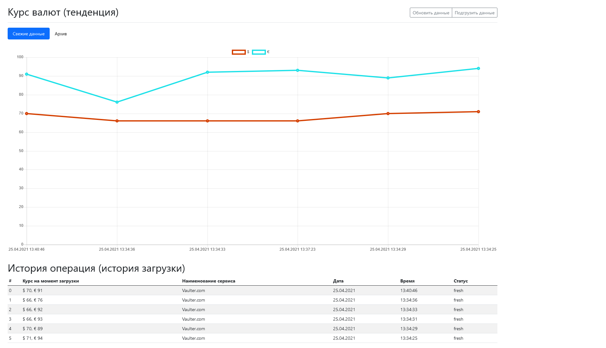

# php-bitrix-money.vaulter

Vaulter
...CurlTransmitter (класс для получения данных с другого сайта, curl_get)
...External
......IExternalMoney (интерфейс, для реализации сервиса)
......ExternalVaulterCom (сервис сайта, реализующий интерфейс ExternalVaulterCom, сайт vaulter.com - api сайта находится по адресу localhost/api/vaulter.com.php (имитация))
...MoneyVault (класс отвечающий за все подключенные сервисы и получение информации от них)
---

